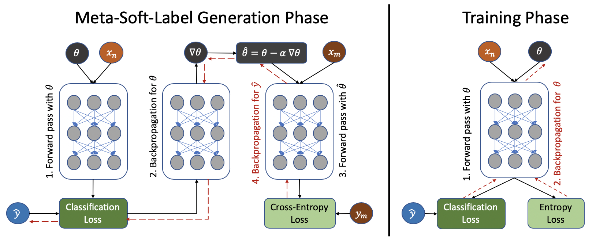

# Meta Soft Label Generation for Noisy Labels, ICPR-2020
Official code for paper [Meta Soft Label Generation for Noisy Labels](https://arxiv.org/abs/2007.05836) accepted by ICPR 2020.


*Illustration of the proposed MSLG algorithm*

Requirements:
* torch
* torchvision
* scikit-learn
* matplotlib

## Running Proposed Algorithm

Code can be run as follows:

```
python main.py -d dataset_name -n noise_type -r noise_ratio -s batch_size -a alpha -b beta -g gamma -s1 stage1 -s2 stage2 -k K -m metadata_num
```

where options for input arguments are as follows

* **dataset_name:** cifar10, clothing1M, food101N
* **noise_type:** feature-dependent, symmetric (valid only for cifar10 dataset for synthetic noise)
* **noise_ratio:** integer value between 0-100 representing noise percentage (valid only for cifar10 dataset for synthetic noise)
* **batch_size:** any integer value
* **alpha:** float alpha value 
* **beta:** float beta value
* **gamma:** float gamma value
* **stage1:** integer epoch value for stage1
* **stage2:** integer epoch value for stage1
* **K:** integer K multiplier for label initialization
* **metadata_num:** number of meta-data

Any of the input parameters can be skipped to use the default value. For example, to run with default values for all parameters:

```
python main.py -d clothing1M
```
## Running Baseline Methods

Baseline methods can be run as follows:

```
python baselines.py -d dataset_name -n noise_type -r noise_ratio -m model_name 
```

where baseline model can be one of the followings:

* **model_name:** cross_entropy, symmetric_crossentropy, generalized_crossentropy, bootstrap_soft, forwardloss, joint_optimization, pencil, coteaching, mwnet, mlnt
